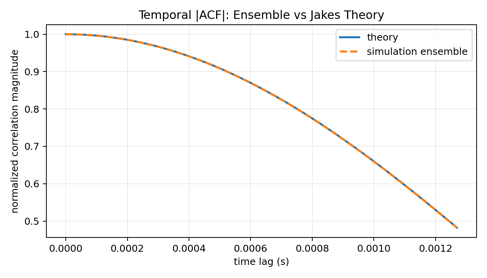
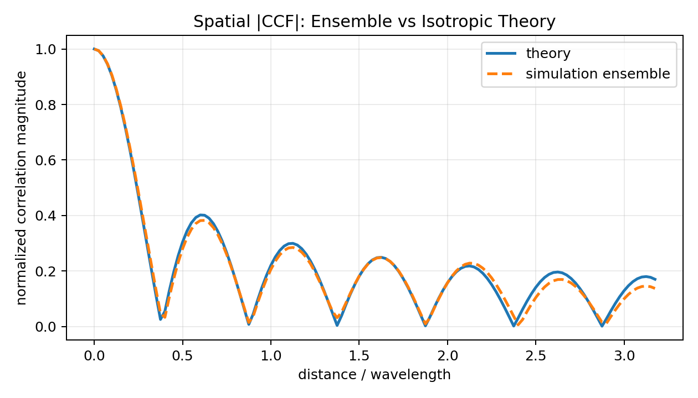
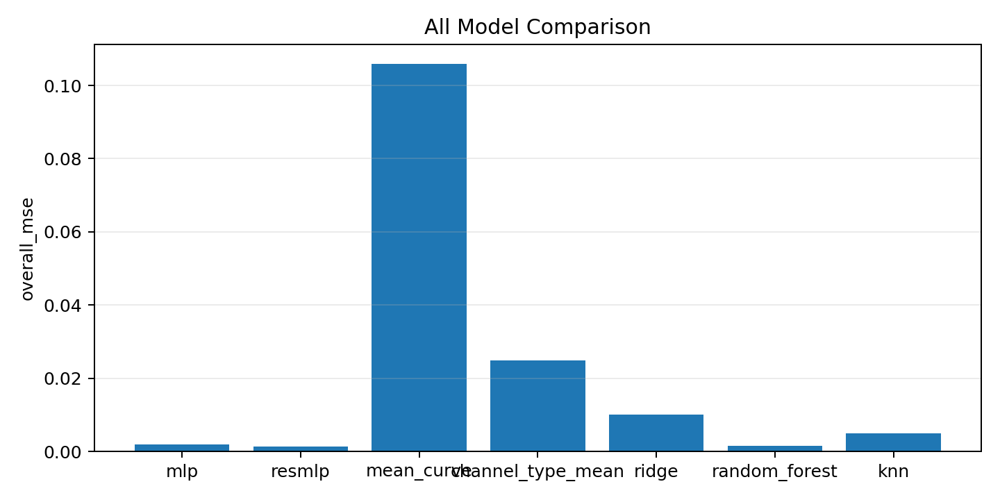
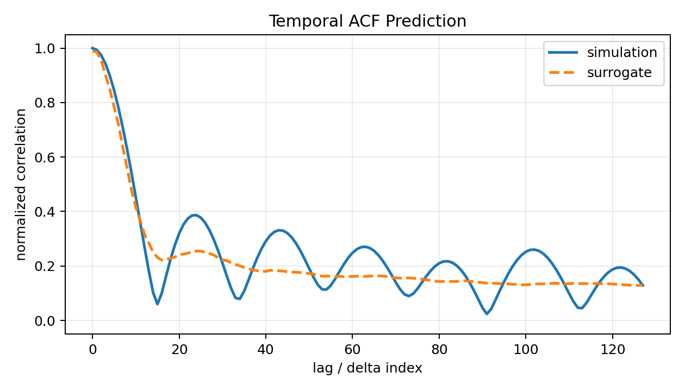
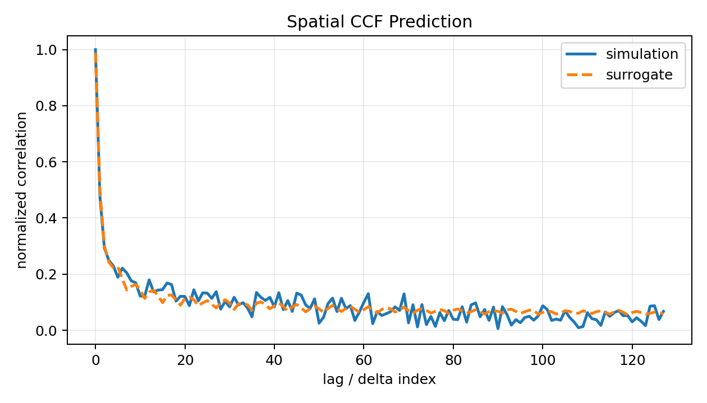
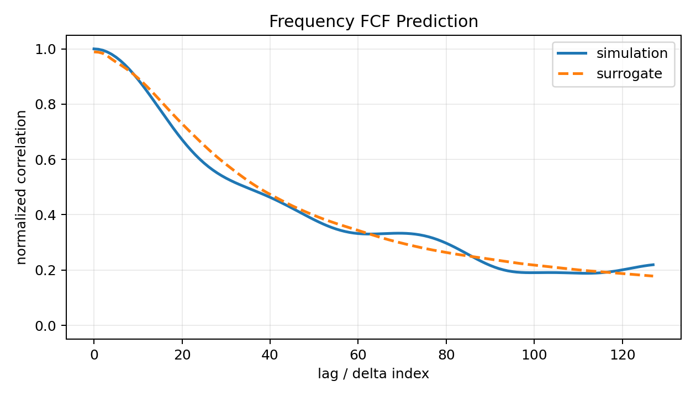
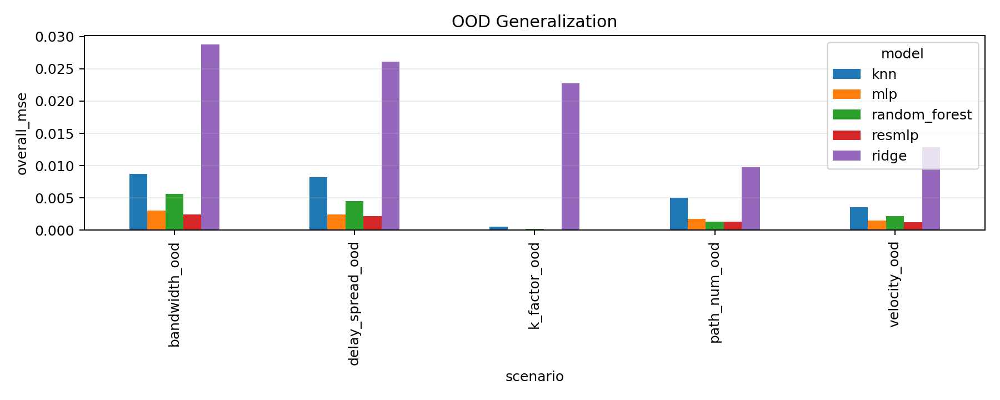
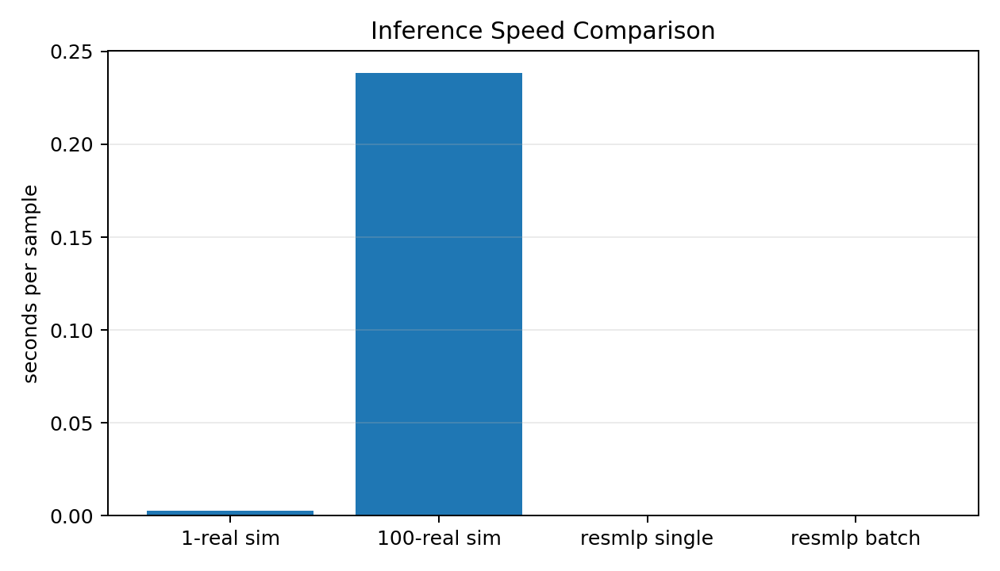

# CorrTwin-Net: Deep Surrogate Modeling for Wireless Channel Correlation Functions

CorrTwin-Net is a development-preview AI + wireless communication project for fast prediction of normalized ensemble correlation magnitudes. It focuses on the mapping:

```text
clean channel scenario parameters -> normalized ensemble |Temporal ACF| / |Spatial CCF| / |Frequency FCF| curves
```

It is not a conventional CSI estimator, OFDM detector, neural receiver, or semantic communication project. The traditional simulator remains the label generator, while the learned models act as offline-trained surrogates for fast parameter sweeps and sensitivity analysis.

## Motivation

Wireless channel studies often need repeated sweeps over carrier frequency, mobility, multipath count, Rician K-factor, antenna spacing, delay spread, and bandwidth. Running the simulator for every parameter point is reliable but can be slow. CorrTwin-Net explores whether machine-learning models can approximate clean-channel ensemble ACF/CCF/FCF magnitude curves quickly after offline training.

## Key Contributions

- Joint normalized ensemble `|ACF|/|CCF|/|FCF|` curve prediction.
- Clean-channel labels that do not add AWGN and do not use SNR as a formal input.
- Complex correlation statistics are ensemble-averaged before taking magnitude.
- Explicit Rayleigh/Rician channel type feature.
- Lightweight theory validation for temporal ACF, spatial CCF, and frequency FCF.
- MLP and ResMLP PyTorch surrogates.
- Ridge, RandomForest, and KNN traditional ML baselines.
- OOD generalization tests over unseen channel parameters.
- Speed comparison between traditional simulation and surrogate inference.
- Reproducible run directories, pytest tests, and GitHub Actions CI.

## Method Overview

```text
communication parameters x
  -> Rayleigh / Rician multipath simulator
  -> ensemble-averaged |ACF| / |CCF| / |FCF| labels y
  -> MLP / ResMLP / sklearn baselines
  -> curve prediction + metrics + speed/OOD analysis
```

Input vector:

```text
[is_rician, fc, velocity, num_paths, k_factor_db, antenna_spacing, delay_spread, bandwidth]
```

Formal target:

```text
y = concat([|ACF|_N, |CCF|_N, |FCF|_N])
```

## Quick Start

```bash
python experiments/run_full_pipeline.py --quick
```

Quick mode uses `120` samples, `64` curve points, `16` realizations per label, `3` training epochs, and `include_ccf=True`.

## Formal Reproduction

Recommended full command for a long formal run:

```bash
python experiments/run_full_pipeline.py --formal
```

The current formal P0 clean-channel benchmark was produced with:

```bash
python experiments/run_theory_validation.py --curve-points 128 --num-realizations 2000 --validate-actual-generator --results-dir results_formal_p0
python experiments/run_generate_dataset.py --samples 10000 --curve-points 128 --include-ccf --num-realizations 100 --output-dir data_formal_p0
python experiments/run_train_mlp.py --epochs 100 --batch-size 64 --data-dir data_formal_p0 --results-dir results_formal_p0
python experiments/run_train_resmlp.py --epochs 100 --batch-size 64 --data-dir data_formal_p0 --results-dir results_formal_p0
python experiments/run_train_sklearn_baselines.py --rf-estimators 100 --data-dir data_formal_p0 --results-dir results_formal_p0
python experiments/run_evaluate_curves.py --model mlp --data-dir data_formal_p0 --results-dir results_formal_p0
python experiments/run_evaluate_curves.py --model resmlp --data-dir data_formal_p0 --results-dir results_formal_p0
python experiments/run_compare_all_models.py --results-dir results_formal_p0
python experiments/run_ood_generalization.py --all --samples 2000 --curve-points 128 --include-ccf --num-realizations 100 --results-dir results_formal_p0
python experiments/run_speed_comparison.py --model resmlp --runs 300 --num-realizations 100 --results-dir results_formal_p0
python experiments/run_realization_convergence.py --curve-points 128 --reference-realizations 2000 --results-dir results_formal_p0
python scripts/build_artifacts_manifest.py --data-dir data_formal_p0 --results-dir results_formal_p0 --output artifacts_manifest_formal_p0.generated.json
python scripts/verify_artifacts.py --manifest artifacts_manifest_formal_p0.generated.json
```

## Simulator Validation

The project includes lightweight theory sanity checks:

- Temporal `|ACF|`: Clarke/Jakes form `|J0(2*pi*fD*tau)|`.
- Spatial `|CCF|`: isotropic arrival-angle Bessel reference.
- Frequency `|FCF|`: exponential PDP reference.





Validation metrics are saved in `results_formal_p0/metrics/theory_validation.json`.

## Main Results

Current formal P0 clean-channel benchmark results with `10000` samples, `128` points per curve, and `100` realizations per label:

| Model | Overall MSE | Overall MAE | Overall Corr | ACF MSE | CCF MSE | FCF MSE |
|---|---:|---:|---:|---:|---:|---:|
| ResMLP | 0.001383 | 0.022161 | 0.972651 | 0.002942 | 0.000575 | 0.000630 |
| RandomForest | 0.001472 | 0.024120 | 0.959782 | 0.002523 | 0.000946 | 0.000948 |
| MLP | 0.001898 | 0.025610 | 0.962286 | 0.004411 | 0.000616 | 0.000666 |
| KNN | 0.004949 | 0.040444 | 0.946940 | 0.011333 | 0.001392 | 0.002123 |
| Ridge | 0.010081 | 0.066477 | 0.815992 | 0.019052 | 0.001629 | 0.009563 |
| Channel-Type Mean | 0.024805 | 0.113154 | 0.847950 | 0.034231 | 0.011547 | 0.028638 |
| Mean Curve | 0.105983 | 0.290361 | 0.838050 | 0.117091 | 0.138170 | 0.062689 |

In this corrected benchmark, ResMLP is the best overall model, while RandomForest remains a strong traditional baseline.



Prediction examples:







## OOD Generalization

OOD scenarios include high velocity, high Rician K-factor, larger path count, larger delay spread, and wider bandwidth. Results are saved to `results_formal_p0/metrics/ood_generalization.csv`.



## Speed Comparison

Current speed comparison:

| Method | Seconds per sample |
|---|---:|
| Single-realization simulator | 0.002486 |
| 100-realization ensemble simulator | 0.238618 |
| ResMLP single-sample latency | 0.000737 |
| ResMLP batched throughput | 0.000005 |

The speed report separates single-sample latency from batched throughput because these are different deployment regimes.

## Realization Convergence

The current convergence study compares smaller ensemble sizes with an `N=2000` reference. For the representative Rayleigh scenario at `128` curve points, `N=100` gives label MSE about `1.76e-4` versus the reference. Results are saved to `results_formal_p0/metrics/realization_convergence.csv`.



## Reproducibility

Training scripts support `--seed`, `--run-name`, and run-directory outputs. Example:

```bash
python experiments/run_train_mlp.py --epochs 3 --seed 42 --run-name test_mlp_seed42
```

This creates:

```text
results/runs/test_mlp_seed42/
+-- config.yaml
+-- metrics.json
+-- training_log.csv
+-- model.pt
```

## Tests and CI

Run local tests:

```bash
pytest -q
```

GitHub Actions workflow is provided at `.github/workflows/python-ci.yml`.

## Documentation

- `docs/project_report.md`: project report.
- `docs/experiment_protocol.md`: data, metrics, baselines, and OOD protocol.
- `docs/reproducibility.md`: environment and reproduction notes.
- `docs/interview_notes.md`: interview-ready explanations.
- `docs/resume_description.md`: Chinese and English resume text.
- `docs/limitations_and_future_work.md`: limitations and next steps.

## Project Structure

```text
CorrTwin-Net/
+-- channel_sim/
+-- models/
+-- experiments/
+-- utils/
+-- tests/
+-- docs/
+-- notebooks/
+-- results_formal_p0/        # tracked formal figures and lightweight metrics
+-- data_formal_p0/           # metadata tracked; large NPZ files are generated locally
+-- results/                  # generated quick-run outputs, ignored by Git
+-- data/                     # generated quick-run data, ignored by Git except sample data
+-- .github/workflows/
```

## Large Artifacts

Large datasets and model weights are not committed. Files such as `data_formal_p0/*.npz`, `results_formal_p0/checkpoints/*.pt`, and `results_formal_p0/runs/**/*.pkl` are generated locally by the reproduction scripts. The repository keeps formal P0 figures, lightweight metrics, metadata, and SHA256 manifests so results can be inspected without uploading multi-GB artifacts.

If release assets are published later, download instructions should be added here and matched against `artifacts_manifest_formal_p0.generated.json`.

## Limitations

- This is a development-preview research prototype with a completed formal P0 benchmark, not a production-grade wireless simulator.
- The current simulator is lightweight and does not replace 3GPP, GBSM, BDCM, ray-tracing, or measured channel datasets.
- The current task predicts normalized ensemble correlation magnitudes, not full signed/complex correlation functions.
- The generated data comes from simulation, not real measurements.
- The surrogate model is intended for fast parameter sweeps and sensitivity analysis, not for replacing communication theory or receiver-side CSI estimation.
- OOD tests cover selected parameter shifts and do not prove universal real-world generalization.

## Future Work

- Replace or augment the simulator with RIS-V2V GBSM/BDCM labels.
- Add DeepMIMO, Sionna, or ray-tracing data backends.
- Add uncertainty estimation for distribution-shift detection.
- Add physics-informed loss terms for smoother and more constrained correlation curves.

## Resume Description

CorrTwin-Net: Built a PyTorch-based wireless channel statistics surrogate-modeling pipeline that generates Rayleigh/Rician ACF/CCF/FCF labels, trains MLP/ResMLP models and traditional ML baselines, and evaluates prediction accuracy, inference speed, theory sanity checks, and OOD generalization.
